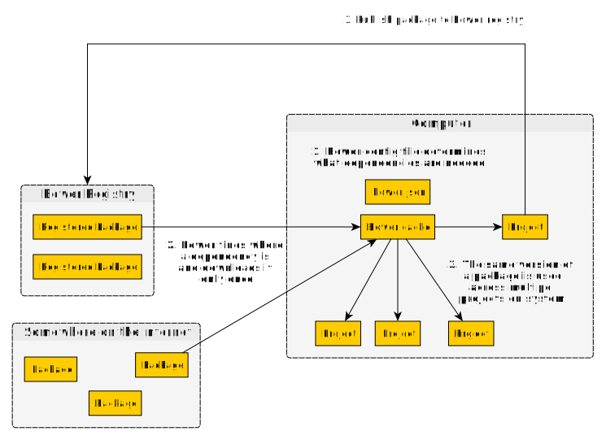
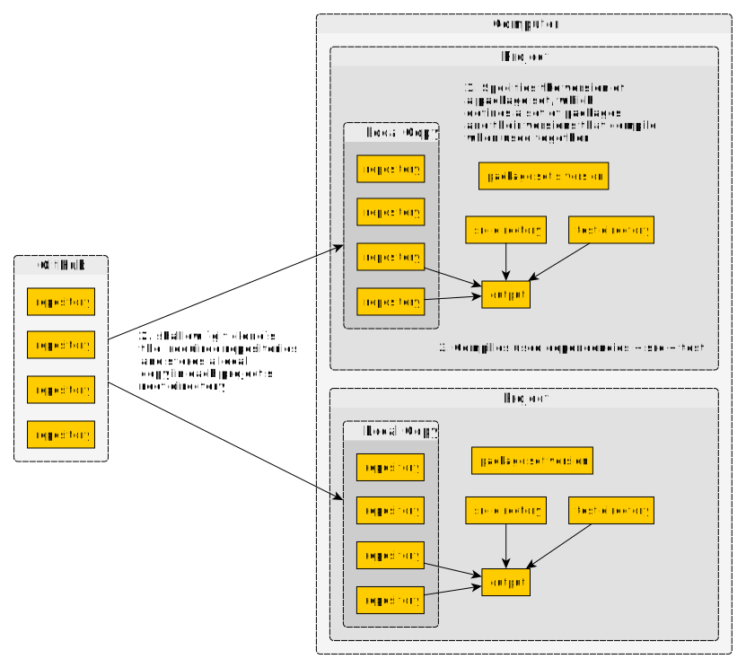
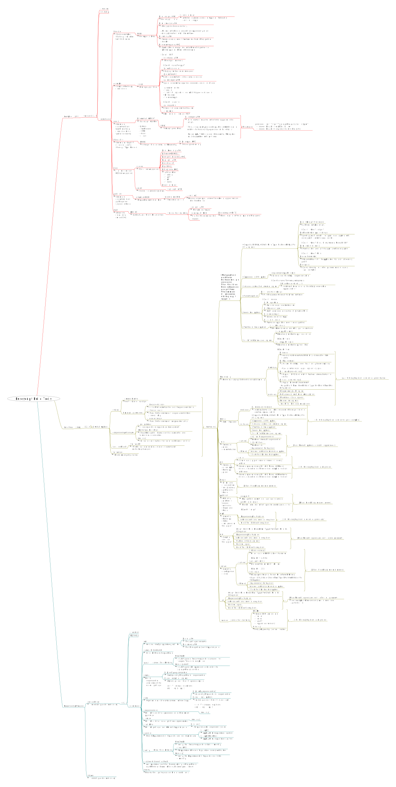

# Build Tools

For a list of editors one can use, see [this list](https://github.com/purescript/documentation/blob/master/ecosystem/Editor-and-tool-support.md#editors)

For build-related tools, see [this list](https://github.com/purescript/documentation/blob/master/ecosystem/Editor-and-tool-support.md#build-tools-and-package-managers)

## Dependency Manager

### Why doesn't Purescript use `npm`?

The following provides a much shorter explanation of [this article](https://harry.garrood.me/blog/purescript-why-bower/)

Short answer:
- Because NPM doesn't produce a compiler error when multiple versions of the same transitive dependency are used.

Long answer:
- When package `foo` requires `bar v1.0.0` and package `baz` requires `bar v2.0.0`, NPM, will "nest" the packages, so that they will compile
- Should one or both packages export something that exposes `bar` and our code uses it, this will produce a runtime error, either because some API doesn't exist (e.g. one version changed/removed some API) or because a pattern match didn't work (e.g. an `instanceOf` check failed due to seeing different `data Bar` types)
- Bower (the 'official' version) uses "flat" dependencies, so we get the compile error when this situation arises. How? It'll ask you what you want to do to resolve the issues. Rather than decide one over the other, you pull out and rethink through your dependencies.

However, `bower` isn't the only package manager one can use.

### Which dependency manager should I use: Bower or PSC-Package?

One can refer to each with a "crude name" that summarizes them:
- Typical package manager (Bower)
- Glorified `git clone` tool (psc-package)

Those names, plus these flowcharts, will help one get an overview of how they work:





Now for a side-by-side comparison (an "apples to oranges" comparison)

| | Bower | Psc-Package |
| - | - | - |
| Design Goals | ? | [See this summary](https://github.com/purescript/psc-package#design-goals)
| Official/Unofficial | Official | Unofficial
| Trajectory | Moving away | Moving towards
| Pros | <ul><li>Bower caches its dependencies, so you can download a version of a package only once and use it everywhere on your system</li><li>It's the "official" dependency manager for Purescript</li></ul> | <ul><li>**Defines a set of versions of specific packages that are proven via CI to work together**</li><li>Uses Git to work, which is usually already installed on all systems</li><li>Reliably produces reproducible Purescript dependencies</li><li>Reduces verbosity somewhat by omitting the `purescript-` prefix on PureScript packages</li></ul>
| Cons | <ul><li>**Figuring out which version of a package works with another version of a package is needlessly time-consuming**</li><li>Uses node to work, which may not be installed on all systems</li><li>Doesn't always produce reproducible dependencies due to its caching feature.</li></ul> | <ul><li>Uses more memory due to duplicating code when one has multiple projects across their system.</li><li>Not the "official" package manager (but who really determines what is 'official' anyway?)</li><li>If the standard package set does not have some package in it, one must maintain their own copy. (However, [Spachetti](https://github.com/justinwoo/spacchetti) makes it easier to deal with this. [Read its guide](https://spacchetti.readthedocs.io/en/latest/))</li></ul>

## Build commands

[See Pulp's ReadMe](https://github.com/purescript-contrib/pulp)

- Create a new project:
    - Bower - `pulp init projectName`
    - PSC Package `pulp init --psc-package projectName`
- Launch the REPL: `pulp repl`
- Build project:
    - When developing: `pulp --watch build --to fileName.js` (add `--psc-package` after `pulp` to use that DM
    - When producing: `pulp build --to fileName.js`
- Run project: `pulp run -- command-line-arg1 command-line-argN`
- Test project: `pulp test` or `pulp --watch test`
- Build docs:
    - Exclude Dependencies: `pulp docs`
    - Include Dependencies: `pulp docs [--with-dependencies]`
    - Change outputted format: `pulp docs -- --format html`
- Bundle project:
    - When developing: `pulp --watch browserify --to fileName.js`
    - When producing: `pulp browserify --optimize --to fileName.js`

### A new project (using Bower): from start to finish:
````bash
# create project
pulp init projectName

# after setting up its dependencies
npm install
bower install

# now start developing

# TODO: immediate feedback (not sure if this is correct yet...)
pulp --watch build --to development/fileName.js

# add a new dependency
bower install --save [dependency]

# update all dependencies
bower update

# build project
pulp browserify --optimize --to production/fileName.js

# bump project version
pulp version [major | minor | patch]

# publish it to Github, register it on Bower's registry, upload docs to Pursuit
pulp publish
````

## Documenting CLI Options

It's easier to read through the CLI's documentation by reading them in a mind-map format rather than a man-page-like doc.

Download [Freeplane](https://www.freeplane.org/) to read through the documenation in a mind-map format


Otherwise, read through the SVG file:



## Other Helpful Links

- [NPM SemVer calculator](https://semver.npmjs.com/)
