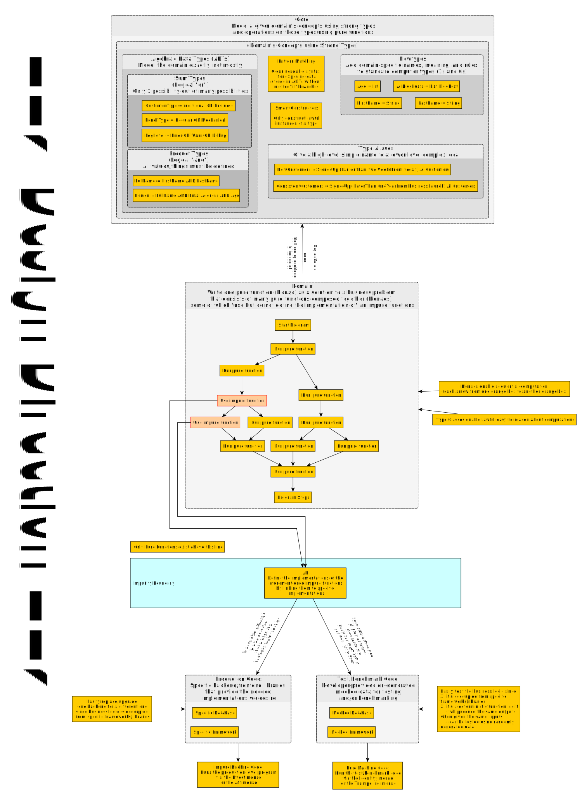

# FP - The Big Picture

Here's a sneak peek as to what the design process for writing FP programs looks like. **Note: I assume you're already familiar with pure and impure functions.** If not, see `FP Philosophical Foundations/Pure-vs-Impure-Functions.md`:

