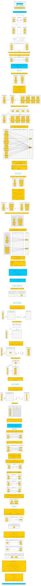
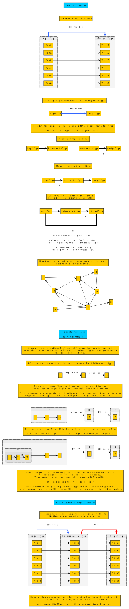

# Composition Everywhere

**TL;DR**

Watch [The Power of Composition](https://youtu.be/vDe-4o8Uwl8?t=8)

By "composition," we mean, "Assemble a few low-level reusable pieces into a higher-level piece." Here are some examples:
- (Classic example) [Legos](https://www.wikiwand.com/en/Lego). Using small blocks of plastic, people can create all sorts of interesting things.
- Furniture. Using wood, metal, fabric, glass, and nails, people can create tables, chairs, desks, cabinets, etc.

But what kinds of things do we compose? In Functional Programming, we compose types (called `algebraic data types`) and functions.

## Composing Types Algebraically

Algebraic Data Types (ADTs) use Algerbra to define the total number of values a given type can have.

There are two videos worth watching in this regard. The table and visualizations that follow merely summarizes their points, except for the ideas behind the `List` and `Tree` types in the second video.
- This video very clearly explains ['Algebraic Data Types' as "Composable Data Types" (stop at 12:40)](https://youtu.be/Up7LcbGZFuo?t=1155). It uses a different syntax than `PureScript` but the ideas still apply.
- This video (which unfortunately has terrible sound quality) explains the "algebraic laws" behind ADTs. Unlike the above video, it also covers `List`s and `Tree`s: [The Algebra of Algebraic Data Types](https://www.youtube.com/watch?v=YScIPA8RbVE)

| Name | Math Operator | Logic Operator | PureScript Type | Idea
| - | - | - | - |
| Product Type | `x * y` | AND | `Tuple` | "One value from type `x` **AND** one value from type `y`"
| Sum Type | `x + y` | OR | `Either` | "One value from type `x` **OR** one value from type `y`"
| Expoential Type | `y^x` | ??? | `InputType -> OutputType` | ???

## Composing Functions

Similar to types, functions also compose but in a slightly different way. Look over the below image and then watch the video at the end (if you haven't seen it already).

Video link: [Logging a function's name each time it is called: migrating an "object-oriented paradigm" solution to an "functional paradigm" solution](https://www.youtube.com/embed/i9CU4CuHADQ?start=540)
