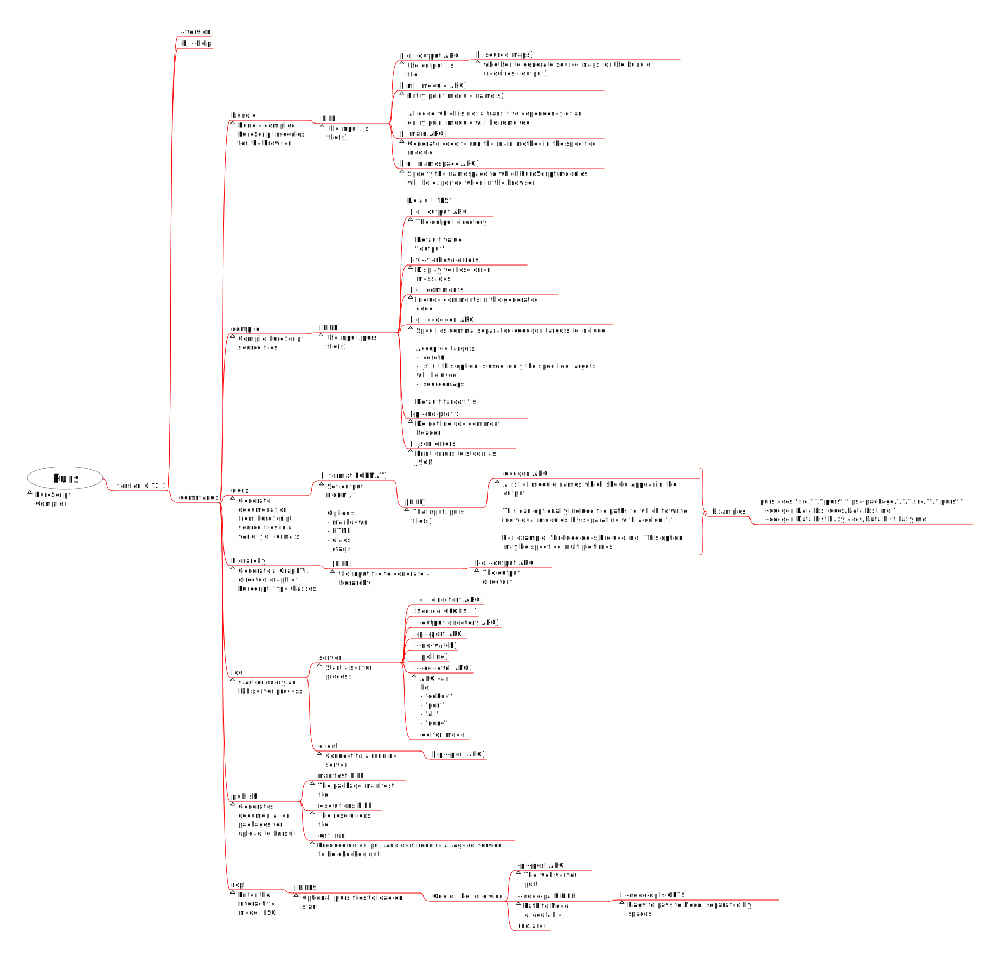
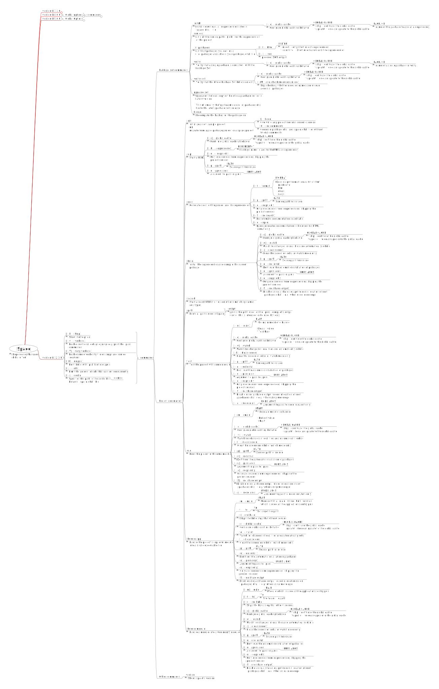

# CLI Programs: All Options Explained

It's easier to understand how to use various programs (e.g. `purs`, `pulp`, `spago`, etc.) by reading through their docs a mind-map format rather than in a man-page-like format.

Download [Freeplane](https://www.freeplane.org/) to read through the documentation in a mind-map format

## Purs (PureScript Compiler)

Documented version: `0.12.3`

[CLI Options: Purs (mindmap)](./assets/CLI-Options--Purs.mm)

## Purs (PureScript Compiler)

Documented version: `0.7.2.0`

[CLI Options: Spago (mindmap)](./assets/CLI-Options--Spago.mm)

## Pulp (PureScript Build Tool)

Documented version: `12.3.0`

[CLI Options: Pulp (mindmap)](./assets/CLI-Options--Pulp.mm)

