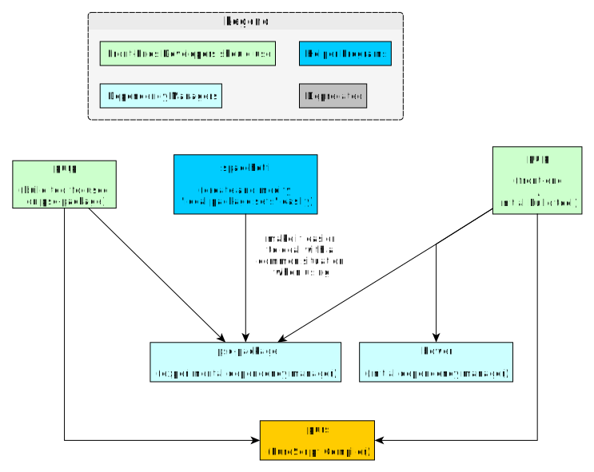
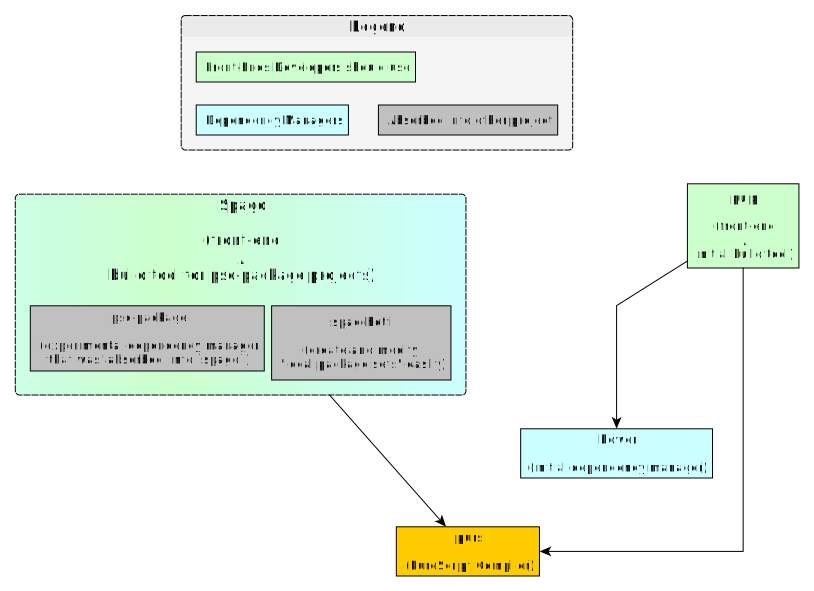

# Build Tools

This folder accomplishes the following:

- Explain the various tools used throughout the ecosystem and their usages/differences:
    - Document the differences between `Bower` and `psc-package` dependency managers
    - Document the difference between `pulp` and `purs-loader` build tools
- Document the CLI options for the most popular tools (e.g. purs, pulp, psc-package, etc.)
- Document a typical workflow from project start to finish (creation, fast-feedback development, initial publishing, 'bump' publishing)

## History: How We Got Here

### Phase 1: Initial Tooling

PureScript's compiler was originally called `psc` (<strong>P</strong>ure<strong>S</strong>cript <strong>C</strong>ompiler) before later being renamed to `purs`. (We'll see this `psc` name reappear elsewhere in a related project).

PureScript did not use `npm` as a dependency manager because of an issue related to transitive dependencies. Thus, they used `bower` because it fit their goals/requirements better. (All of this is covered more in the `Dependency Managers/Bower Explained.md` file).

Bodil Stokke (with later contributions from Harry Garrood) later wrote a tool called `pulp` that worked with `bower` and `purs` to provide a user-friendly developer workflow:
- download your dependencies
- compile, build, and test your project
- publish libraries and their docs
- easily bump the project's version

### Phase 2: Experimentation

`Bower` worked fine, but there were a few user-interface issues that made it difficult to use, especially when a new PureScript release was made that included breaking changes.

As a result, `psc-package` was developed as an experimental dependency manager. It solved some of the problems that `bower` faced. `pulp` later supported `psc-package`, so that one could benefit from the simple developer workflow.

However, `psc-package` encountered its own problems, too. People could not easily create and modify something called a "local package set" (explained later in the `Psc-Package-Explained.md` file).

To resolve these problems, Justin Woo started a project called `spacchetti` (he likes to name his projects via food puns), which made it much easier to create and modify a "local package set."

Since `pulp` seemed to work primarily with `bower`, Justin Woo also created a project called `purp`, which was basically `pulp` but designed to only use `psc-package` as its dependency manager.

See the below image to visualize this:

### Phase 3: Integration

From the above image, one should infer that using `pulp` and `bower` was overall easier to use and explain. To use `psc-package` effectively, one needed to use multiple tools.

Thus, Justin Woo and Fabrizo Ferrai started a project called `spago` to provide a seamless developer workflow for `psc-package` and its related projects (similar to what `pulp` did for `bower`).

The below image summarizes the current state:

## Overview of Tools

| Name | Type/Usage | Comments | URL |
| - | - | - | - |
| purs | PureScript Compiler | Used to be called `psc` | -- |
| psvm-js | PureScript Version Manager | -- | https://github.com/ThomasCrevoisier/psvm-js
| bower | Dependency Manager | -- | https://bower.io/ |
| psc-package | Dependency Manager | -- | https://github.com/purescript/psc-package |
| pulp | Build Tool | Front-end to `purs`. Builds & publishes projects | https://github.com/purescript-contrib/pulp |
| spago | Build Tool | Front-end to `purs` and `psc-package` projects | https://github.com/spacchetti/spago
| pscid | `pulp --watch build` on steroids | Seems to be a more recent version of `psc-pane` (see below) and uses `psa` | https://github.com/kRITZCREEK/pscid
| psa | Pretty, flexible error/warning frontend for `purs` | -- | https://github.com/natefaubion/purescript-psa

The following seem to be deprecated or no longer used:

| Name | Type/Usage | Comments | URL |
| - | - | - | - |
| psc-pane | Simplistic auto-reloading REPL-based IDE | No longer used? Last updated 1 year ago... | https://github.com/anttih/psc-pane
| gulp-purescript | Gulp-based Build Tool | No longer used? Last updated 1 year ago... | https://github.com/purescript-contrib/gulp-purescript |
| Purify | -- | Deprecated in light of psc-package | -- |

For this repo, we will be using `spago` for our build tool and `psc-package` for our dependency manager.
