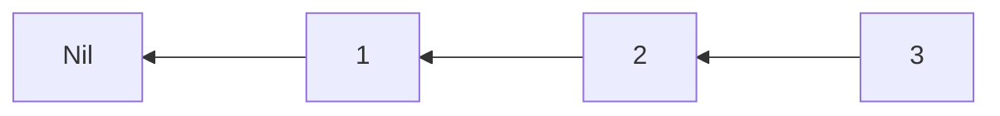
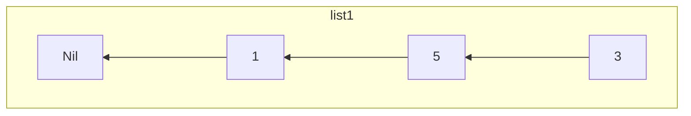
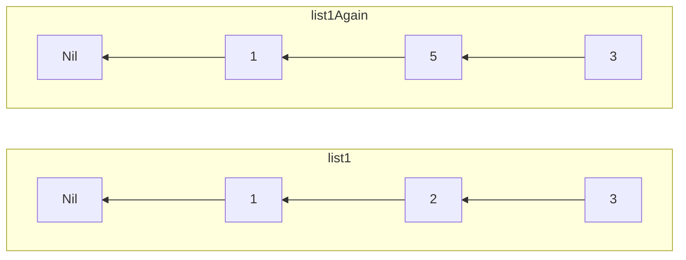
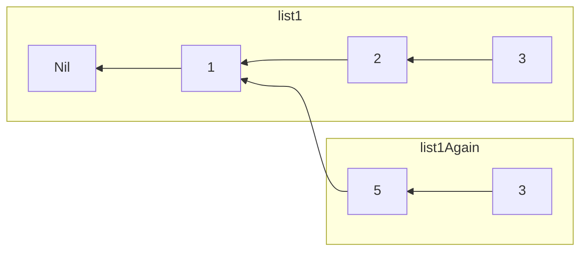

# Data Types

## Principles

In order to abide by the principle of pure functions, FP Data Types tend to adhere to two principles:

1. Immutable - the data does not change once created. To modify the data, one must create a copy of the original that includes the update.
2. Persistent - Rather than creating the entire structure again when updating, an update should create a new 'version' of a data structure that includes the update

We'll use a linked-list (see below) to demonstrate the above two ideas.

Each list is one of two values:
- the end of the list (i.e. `Nil`)
- a node that stores one element in the list and a pointer to the rest of the list (i.e. `...<--[3]`)

## Mutability vs Immutability

Let's say we have a list that is assigned to the variable `list1`:

Let's say we want to change element `2` to `5`. There are a few ways we could do this modification to `list1`.

The first way is to mutate `list1` directly, so that `list1` refers to new list. A data type that gets modified like this is a **mutable data type**.

Before our modification, this is what `list1` looks like:

After our modification, this is what `list1` looks like:

The second way is to create a new version of `list1` called `list1Again`. A data type that gets modified like this is an **immutable data type**.

Before our modification, this is what `list1` looks like:

After our modification, `list1` is unchanged, but the "modified version" is now `list1Again`:

### Pros & Cons

| Topic | Mutable Data Types | Immutable Data Types |
|-|-|-|
| Reasoning | Code is harder to reason about: `list1` can refer to different values at different times | Code is easier to reason about: `list1` always refers to the same value |
| Memory Usage | Uses less memory; low pressure on garbage collector | Uses more memory; higher pressure on garbage collector |
| Multi-Threading | Risk of deadlocks, race conditions, etc. | No such risks |

## Immutable Data Types: Persistent or Not

There are two ways to modify an immutable data type.

First, one can choose NOT to share values across the copies. This is what was shown previously:

Second, one can choose to share values across the copies. This is an example of a **persistent immutable data structure**. Sharing is caring:

## Big O Notation

FP data types have `amortized` costs. In other words, most of the time, using a function on a data structure will be quick, but every now and then that function will take longer. Amortized cost is the overall "average" cost of using some function.

These costs can be minimized by making data structures `lazy` or by writing impure code in a way that doesn't "leak" its impurity into the surrounding context.
