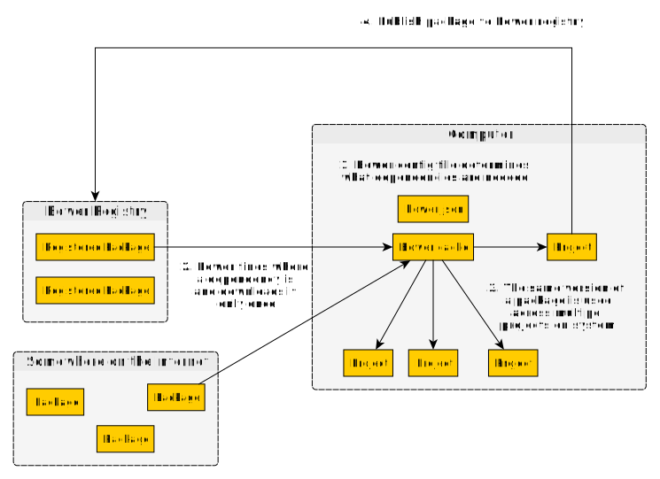

# Bower Explained

**Note:** The `Bower` registry has been deprecated. The PureScript community is in the process of creating a registry. When that is done, we will stop using `bower` entirely. In the meantime, you must still use `bower` + `pulp` to publish libraries' docs to Pursuit. One can still use `bower` as a dependency manager, however, one will need to depend on other libraries using the full repo url in the `bower.json` file:
```diff
"dependencies": {
-    "purescript-some-library": "^0.1.0"
+    "purescript-some-library":"https://github.com/githubUser/purescript-some-library#my-branch"
}
```

## What is it?

A typical dependency manager that downloads dependencies from a centralized repository (i.e. Bower Registry) or GitHub.



## Why Use It?

When developing a library, one needs to refer to specific versions of dependencies that do not change over time.

If one uses `spago`, they can modify the "binary" of the dependency without changing the version to which it refers. For application developers, this can be desirable. Not so for library developers.

Some people prefer `bower` over `spago` while others do not. Learn about both and make your decision.

### Why doesn't Purescript use `npm`?

The following provides a much shorter explanation of [Why the PureScript Community Uses Bower](https://harry.garrood.me/blog/purescript-why-bower/)

Short answer:
- Because NPM doesn't produce an error when multiple versions of the same transitive dependency are used.

Long answer:
- When package `child1` requires `parent v1.0.0` and package `child2` requires `parent v2.0.0`, NPM, will "nest" the packages, so that the code will compile.
- Should one or both packages export something that exposes `parent` and our code uses it, this will produce a runtime error, either because some API doesn't exist (e.g. one version changed/removed some API) or because a pattern match didn't work (e.g. an `instanceOf` check failed due to seeing different types defined in the `parent` package)
- Bower uses "flat" dependencies, so it will notify you that such an issue exists by asking you to choose the library version you want to use to resolve the issue.

## Problem Points?

- The issues stated above.
- You must use `npm` to install any JavaScript libraries for bindings. This is true for `bower` and `spago` alike.
- `pulp` doesn't provide a command that wraps `esbuild` (e.g. `pulp bundle-app`) whereas `spago` does.

### Solution to Most Common Bower Problem: The Cache Mechanism

When in doubt, run the following command, reinstall things, and see if that fixes your issue:
```bash
# Deletes the 'bower_components' and 'output' directories,
# ensuring that the cache mechanism is not corrupting your build
# and that the next build will be completely fresh.
bower cache clean && rm -rf bower_components/ output/
```

### Horrible User Experience Occurs After a Breaking Change Release

The following issue is happening less and less frequently due to the PureScript language stabilizing, but it still needs to be stated.

#### Annoyance Defined

If a compiler release that includes breaking changes was released recently, it will take some time for libraries in the ecosystem to become compatible with that release. If you are using Bower as your dependency manager, it may try to install libraries that are not compatible with the new release, creating problems.

#### Recommended Guidelines

In such circumstances, follow these guidelines to help find the correct version of a library:
- Go to Pursuit and look at the library's package page. Choose one of the library's versions and compare that version's publish date with the date of the compiler release. Those that occur after the compiler release are likely compatible with the new release.
- Since `purescript-prelude` is a dependency for most libraries, see which version of `purescript-prelude` the library uses. That should indicate whether it's compatible with a new compiler release or not.
- If all else fails, check the library's last few commit messages in its repository for any messages about updating to the new compiler release.
