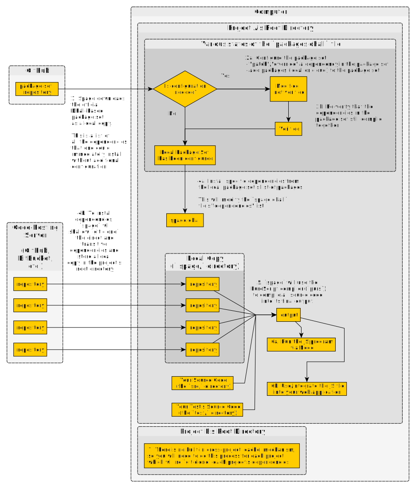

# Spago Explained

## What is it?

A way to use specific versions of libraries that are known to compile together without problems, as verified by CI.

## Why Use It?

`spago` only allows you to use dependencies that compile together on a specific PureScript release. You do not have to track down which version of a `DependencyA` to use to ensure it compiles when you also use `DependencyB`. Moreover, you don't have to verify that `DependencyA` at `v1.0.0` works on PureScript release `0.13.8` instead of `0.11.7`.

When a new PureScript release with breaking changes occurs, using `bower` is painful until the ecosystem "catches up." Since a new release draws in a lot of people, their initial exploration of PureScript when using `bower` can be horrible.

`spago` also allows you to
- 'patch' a dependency with your own version
    - fix a bug in its implementation
    - update a library to a newer PS release if it hasn't been done yet
    - update a library's transitive dependency to a newer release without needing to submit a PR
- add local or cloud-based dependencies not found in the official package set
    - a project you use frequently, like a custom `Prelude` library.
    - a project with your preferred aliases to functions/values (i.e. using `<!>` for `map` instead of `<$>`)

## How does it work?

### Spago Terms

A **package** in this context is 4 things:
1. a Git repo
2. a tag in that repo
3. a set of its dependencies (which are also packages).
4. a name to refer to the combination of the above three things

Thus, a package is a unique named `repo-tag-dependencies` combination (e.g. `prelude` could indicate the [Prelude repo at the 'v4.1.1' tag](https://github.com/purescript/purescript-prelude/tree/v4.1.1)).

A **package set** consists of a set of packages. It's a JSON-like file that maps a package name to its corresponding `repo-tag-dependencies` combination. A package set gets **verified** to ensure that its set of packages compiles together on a given PureScript compiler release. Once verified, they are considered "immutable."

A package set includes all dependencies: direct ones and their transitive dependencies. For example, if the set includes the package, `PackA`, which depends on the package, `PackB`, the package set must include both packages:
- `PackA`
    - Version: `v1.0.0`
    - Repo: `https://exampleRepo.com/PackA.git`
    - Dependencies: `["PackB"]` (spago will look up "PackB" in the package set to resolve it)
- `PackB`
    - Version: `v1.0.0`
    - Repo: `https://exampleRepo.com/PackB.git`
    - Dependencies: `[]` (no dependencies)

### The Process It Uses

Here's a "big picture" flowchart for what a person does and how it fits into their developer workflow:

## Problem Points?

- Major
    - You cannot use this workflow to develop libraries. Use `pulp` and `bower` for that.
- Minor / has workarounds
    - Just like `bower`, you still need to use `npm` to install JavaScript libraries for any PureScript bindings. To understand why, see https://github.com/purescript/spago#why-cant-spago-also-install-my-npm-dependencies
