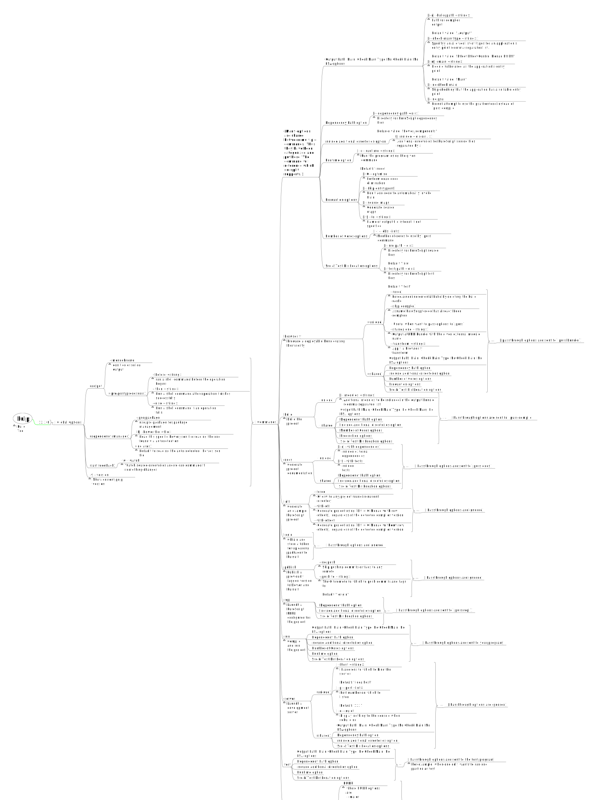

# CLI Programs: All Options Explained

It's easier to understand how to use various programs (e.g. `purs`, `pulp`, `spago`, etc.) by reading through their docs via a mind-map format rather than in a man-page-like format. I used [Freeplane](https://www.freeplane.org/) to create the mind map files in the `./assets/` folder and the below SVG files.

## Purs (PureScript Compiler)

Documented version: `0.12.3`

## Spago (PureScript Build Tool & Dependency Manager)

Documented version: `0.13.0`

There were no CLI changes between `0.12.1` and `0.13.0`:

## Pulp (PureScript Build Tool)

Documented version: `12.3.0`

