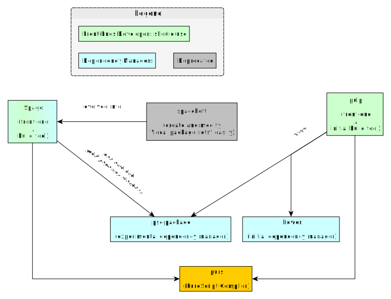

# Build Tools

This folder accomplishes the following:

- Explain the various tools used throughout the ecosystem and their usages/differences:
    - Document the differences between `Bower` and `Spago` dependency managers
    - Document the difference between `Pulp` and `Spago` build tools
- Document the CLI options for the most popular tools (e.g. purs, pulp, spago, etc.)
- Document a typical workflow from project start to finish (creation, fast-feedback development, initial publishing, 'bump' publishing)

## History: How We Got Here

The following explanation does not cover all the tools used in PureScript's ecosystem. However it provides context for later files. 

In short, `spago` is both the official dependency manager and build tool. It was originally written in Haskell. It's currently being rewritten in PureScript. The Haskell version is called `spago-legacy` whereas the rewrite is the alpha `spago`. Whenever this repo mentions `spago`, it's always in reference to `spago-legacy`.

There are two other tools that are only around because alpha `spago` hasn't been finished yet. `bower` can be thought of as a deprecated dependency manager; the community used this tool because it provided a registry. `pulp` is a build tool that uses `bower`; its usage has become less frequent because of the migration towards `spago`.

### Phase 1: Initial Tooling

PureScript's compiler was originally called `psc` (<strong>P</strong>ure<strong>S</strong>cript <strong>C</strong>ompiler) before later being renamed to `purs`. (We'll see this `psc` name reappear elsewhere in a related project).

PureScript did not use `npm` as a dependency manager because of an issue related to transitive dependencies. Thus, they used `bower` because it fit their goals/requirements better. (All of this is covered more in the `Dependency Managers/Bower Explained.md` file).

Bodil Stokke (with later contributions from Harry Garrood) later wrote a tool called `pulp` that worked with `bower` and `purs` to provide a user-friendly developer workflow:
- download your dependencies
- compile, build, and test your project
- publish libraries and their docs
- easily bump the project's version

This is why most of the "core" libraries (PureScript libraries stored under the `purescript` GitHub organization) still have `bower.json` files as their dependencies.

### Phase 2: The `psc-package` Experiment

`Bower` worked fine, but there were a few user-interface issues that made it difficult to use, especially when a new PureScript release was made that included breaking changes.

As a result, `psc-package` was developed as an experimental dependency manager. It solved some of the problems that `bower` faced. `pulp` later supported `psc-package`, so that one could benefit from the simple developer workflow.

However, `psc-package` encountered its own problems, too. People could not easily create and modify something called a "local package set" (a term that is explained later in the `Spago-Explained.md` file).

To resolve these problems, Justin Woo started a project called `spacchetti` (he likes to name his projects via food puns), which made it much easier to create and modify a "local package set."

See the below image to visualize this:

### Phase 3: Improving the `psc-package` Developer Workflow via `Spago`

From the above image, one should infer that using `pulp` and `bower` was overall easier to use and explain. Thus, Justin Woo and Fabrizo Ferrai started a project called `spago`. `spago` evolved out of `spacchetti` and reimplemented parts of `psc-package` into one program with a seamless developer workflow. While `psc-package` can still be used, it became better to use `spago`.

The below image summarizes the current state:

### Phase 4: `Spago` becomes mainstream while `psc-package` is less used

Spago dropped support for `psc-package` commands in the `v0.11.0` release. `psc-package` was still usable and was more or less feature-complete. However, no further work was being done on it. Rather, Spago had become the main dependency manager when utilizing package-sets.

At this point, part of the community used `pulp` + `bower` workflows while the rest used `spago` workflows. One must still use `pulp` + `bower` if they want to do the following:
- publish their library's docs to Pursuit
- include their library in a package set, so `spago` users can use it

### Phase 5: The need for a PureScript registry (Bower registry no longer accepts new uploads)

The Bower registry stopped accepting new uploads. The community quickly updated their tooling to workaround how libraries are published and installed. However, it was clear that PureScript now needed to create a registry.

Fabrizio Ferrai led the effort to build this registry with significant input from Harry Garrood. The registry is not yet complete, so the community is in this in-between stage. See [The `bower` registry is no longer accepting package submissions](https://discourse.purescript.org/t/the-bower-registry-is-no-longer-accepting-package-submissions/1103/) for more context.

### Phase 6: Updating JavaScript output to ES modules and delegating bundling to 3rd-party tools

In PureScript `0.15.0`, we stopped compiling PureScript source code to CommonJS modules and started compiling to ES modules. As a result, we dropped the buggy and broken bundler provided via `purs bundle` and instead directed end-users to use 3rd-party bundlers like `esbuild`, `webpack`, and `parcel`. Such bundlers often produced smaller bundles than `purs bundle`. Moreover, it gave the core team in charge of PureScript one less thing to maintain.

See the [0.15.0 Migration Guide](https://github.com/purescript/documentation/blob/master/migration-guides/0.15-Migration-Guide.md) for more details.

### Phase 7: Producing Optimized JavaScript and Compiling to Other Languages

While the Purescript compiler produces correct JavaScript code, there were a number of optimizations that haven't been implemented in the compiler. However, the compiler was designed to output not just JavaScript, but an intermediate representation called `CoreFn`. This enables others to transform `CoreFn` to another language.

Soon after the time that PureScript `0.15.4` was released, a new project called `purs-backend-es` was released. This project works on the `CoreFn` representation and transforms it to JavaScript. However, it also optimizes the code significantly during this tranformation. For a few example, see [the `purs` and `purs-backend-es` comparison table in its README](https://github.com/aristanetworks/purescript-backend-optimizer#overview).

While this tool's main purpose is to produce optimized JavaScript code, it enables others to produce new backends more easily. A backend is a target language to which PureScript can be compiled. Before this tool, every backend had to reinvent a lot of code to make it work for that language. With the underlying library, `purescript-backend-optimizer`, one can more easily produce a new backend.

### Phase 8: The Registry and the Spago Rewrite

The Registry's speed of development was lackluster for quite some time. Fortunately, Thomas Honeyman made it a personal goal to see the Registry implemented. Since then, the Registry's development picked up and eventually became useable, although it's still not yet finished.

More recently, Fabrizio decided to rewrite Spago in PureScript. The main advantage of doing this was the ability to leverage the Registry codebase within Spago, allowing for a more seamless publishing workflow among other things. Such work is still on-going as of this writing (Sept 2023). But, the version of Spago written in Haskell is now known as "Spago Legacy" and the version written in PureScript is "Spago Next" because one install spago next via `npm i spago@next`.

## Spago: Haskell Legacy codebase or PureScript rewrite codebase?

| Type | NPM Package | Versions | Install via | Alternative |
| - | - | - | - | - |
| Legacy Spago | `spago` | `0.0.1` - `0.21.0` | `npm i spago` | `npm i spago-legacy` (installs `spago@0.21.0` under binary name `spago-legacy`) |
| Rewrite Spago | `spago` | `0.92.0` - `0.93.x` | `npm i spago@next` | - |

## Overview of Tools

| Name | Type/Usage | Comments | URL |
| - | - | - | - |
| purs | PureScript Compiler | Used to be called `psc` | -- |
| spago (rewrite) | Build Tool | Front-end to `purs`; `package-set`-based or dependency-range -based projects | https://github.com/purescript/spago |
| spago (legacy) | Build Tool | Front-end to `purs` and `package-set`-based projects | https://github.com/purescript/spago-legacy
| pulp | Build Tool | Front-end to `purs`. Builds & publishes projects (being deprecated) | https://github.com/purescript-contrib/pulp |
| bower | Dependency Manager (being deprecated) | -- | https://bower.io/ |
| purs-tidy | PureScript Formatter | -- | https://github.com/natefaubion/purescript-tidy
| purs-backend-es | Produces optimized JavaScript from PureScript | Only intended for production-level usage | https://github.com/aristanetworks/purescript-backend-optimizer
| psa | Pretty, flexible error/warning frontend for `purs` | -- | https://github.com/natefaubion/purescript-psa
| pscid | `pulp --watch build` on steroids | Seems to be a more recent version of `psc-pane` (see below) and uses `psa` | https://github.com/kRITZCREEK/pscid
| psvm-js | PureScript Version Manager | -- | https://github.com/ThomasCrevoisier/psvm-js
| esbuild | Low-Config bundler | -- | https://esbuild.github.io/

The following seem to be deprecated or no longer used:

| Name | Type/Usage | Comments | URL |
| - | - | - | - |
| psc-package | Dependency Manager | -- | https://github.com/purescript/psc-package |
| psc-pane | Simplistic auto-reloading REPL-based IDE | No longer used? Last updated 1 year ago... | https://github.com/anttih/psc-pane
| gulp-purescript | Gulp-based Build Tool | No longer used? Last updated 1 year ago... | https://github.com/purescript-contrib/gulp-purescript |
| Purify | -- | Deprecated in light of psc-package | -- |

For this repo, we will be using `spago` for our build tool and dependency manager.
