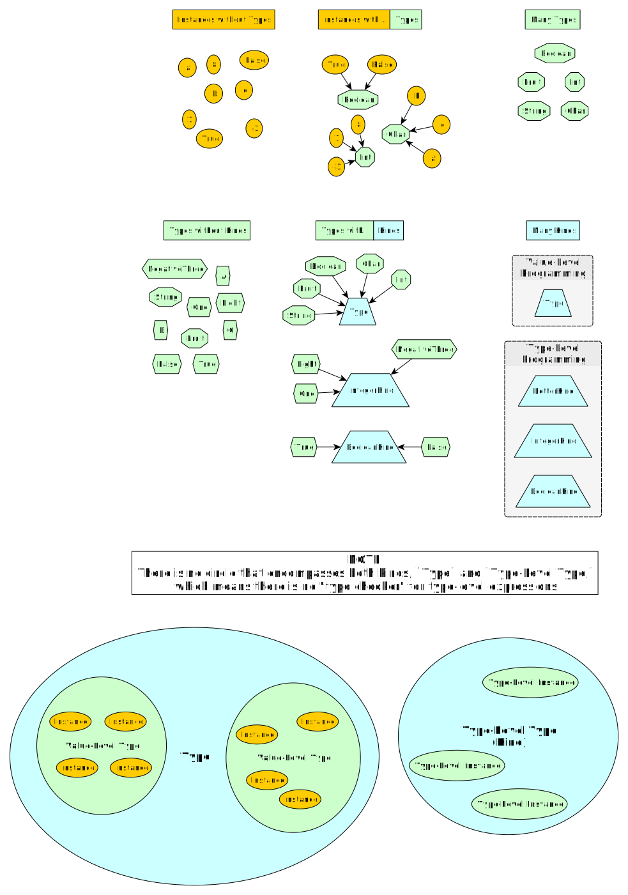

# An Overview of Terms and Concepts

## Comparison

In programming, there are usually two terms we use to describe "when" a problem/bug/error can occur:
- Compile-time: Turns source code into machine code. Compiler errors occur due to types not aligning.
- Runtime: Executes machine code. Runtime errors occur due to values of types not working as expected/verified by the compiler (e.g. you expected a `String` at runtime but got `null`).

## Definition

| Term | Definition | "Runtime"
| - | - | - |
| Value-Level Programming | Writing source code that gets executed during runtime | Node / Browser
| Type-Level Programming | Writing source code that gets executed during compile-time | Type Checker / Type Class Constraint Solver^

^ First heard of this from @natefaubion when he mentioned it in the #purescript Slack channel

## What Are Types and Functions?

### Types Reexamined

When we define a type like so...
```purescript
data MyType
  = Value1
  | Value2
```
... we are saying there is a set or domain called `MyType` that has two members, `Value1` and `Value2`.
Thus, when we write...
```purescript
value1 :: MyType
value1 = Value1
```
... we could also write it with more type information:
```purescript
value1 :: MyType
value1 = (Value1 :: MyType)
```
The syntax `(Value1 :: MyType)` means `Value1` is a value of the `MyType` type (or `Value1` is a member of the `MyType` set/domain)

### Functions Reexamined

Functions can be either pure or impure. Pure functions have 3 properties, but the third (marked with `*`) is expanded to show its full weight:

|     | Pure | Pure Example | Impure | Impure Example |
| --- | ---- | ------------ | ------ | -------------- |
| Given an input, will it always return some output? | Always<br>(Total Functions) | `n + m` | Sometimes<br>(Partial Functions) | `4 / 0 == undefined`
| Given the same input, will it always return the same output? | Always <br> (Deterministic Functions) | `1 + 1` always equals `2` | Sometimes <br> (Non-Deterministic Functions) | `random.nextInt()`
| *Does it interact with the real world? | Never |  | Sometimes | `file.getText()` |
| *Does it acces or modify program state | Never | `newList = oldList.removeElemAt(0)`<br>Original list is copied but never modified | Sometimes | `x++`<br>variable `x` is incremented by one.
| *Does it throw exceptions? | Never | | Sometimes | `function (e) { throw Exception("error") }` |

Pure functions can better be explained as mapping some input to some output. The simplest example is pattern matching:
```purescript
data Fruit = Apple | Orange

stringify :: Fruit -> String
stringify Apple = "Apple"
stringify Orange = "Orange"
```
The function, `stringify`, doesn't "do" anything: it doesn't modify its arguments, nor does it really "use" its arguments in some manner. Rather, it merely defines what to output when given some input.

In this way, functions merely specify how to map values of some type (e.g. Fruit) to values of another type (e.g. String). This idea is the heart of Category Theory. Thus, types and functions go hand-in-hand.

## Kinds Redefined

Previously, we said:
> Kinds = "How many more types do I need defined before I have a 'concrete' type?"

And using the table from earlier...

| Example | Kind | Meaning
| - | -: | - |
| String | Type | Concrete value
| Int | Type | Concrete value
| Box a | Type -> Type | Higher-Kinded Type (by 1)<br>One type needs to be defined before the type can be instantiated
| (a -> b)<br>Function a b | Type -> Type -> Type | Higher-Kinded Type (by 2)<br>Two types need to be defined before the type can be instantiated

This definition sufficed when we were learning only value-level programming. In reality, it's more like this:

| Name | Meaning |
| - | - |
| Kind | A "Type" for type-level programming |
| Type | The "kind" (i.e. type-level type) that indicates a value-level type for value-level programming |

Sometimes, pictures say a lot more than words:


We can now modify the definition to account for this new understanding:
> Kinds = "How many more type-level types do I need defined before I have a 'concrete' type-level type? Also, `kind Type` is a type-level type whose 'values'/'members' are value-level types.

### Summary of Inferred Kinds

Returning to a table we showed previously, we'll add the header that we removed (all caps) when we first displayed the table and include `Record`/`Row`.

| TYPE-LEVEL EXPRESSION | Inferred kind |
|-|-:|
|`Unit`|`Type`|
|`Array Boolean`|`Type`|
|`Array`|`Type -> Type`|
|`Either Int String` | `Type`|
|`Either Int` | `Type -> Type`|
|`Either` | `Type -> Type -> Type`|
|`Record (foo :: Int)`|`Type`|
|`Record`|`# Type -> Type`|
|`(foo :: Int)`|`# Type`|
|...|...|

## Type-Level Programming Flow

Type-Level programming has 2-3 stages:
- Creation
    - Define a type-level value by declaring a literal one
    - **Reification** - convert a value-level (i.e. runtime value) value into a type-level value via a `Proxy` type
- (optional) Modify that value during compile-time
- Terminal
    - Constrain types, so that an impossible state/code fails with a compiler error
    - **Reflection** - convert a type-level value stored in a `Proxy` type into a value-level value

## Related Papers

- [Fun with Functional Dependencies](http://www.cse.chalmers.se/~hallgren/Papers/hallgren.pdf)
