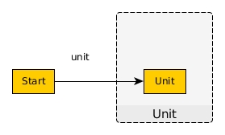

# Unit

A type with 1 value, `Unit`, though most will see it used via `unit`. This IS the C or Java-style `void` type. It usually indicates a "side effect", mutation, or impure code.

```haskell
-- Data.Unit (Unit, unit)

data Unit = Unit

unit :: Unit
unit = Unit
```

It's also used to indicate a `thunk`, a computation that we know how to do but have chosen to delay executing/evaluating until later:
```haskell
type ComputationThatReturns a = (Unit -> a)

thunk :: forall a. a -> ComputationThatReturns a
thunk a = (\_ -> a)

-- We run the pending computation (force the thunk) by passing
-- unit to it:
runPendingComputation :: ComputationThatReturns a -> a
runPendingComputation thunk = thunk unit
```


