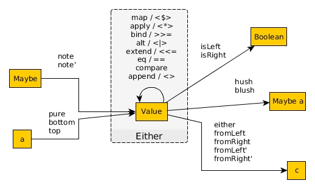

# Either

A type that stores one of two values.

```haskell
data Either a b
  = Left a
  | Right b
```

| Package | Type name | "Plain English" name |
| - | - | - |
| [purescript-either](https://pursuit.purescript.org/packages/purescript-either/) | `Either a b` | Choice of 2 types

| Usage | Values & their Usage
| - | - |
| Used to indicate one type or a second type | <ul><li>`Left a` - a value of `a`</li><li>`Right b` - a value of `b`</li></ul>
| Error handing (when we care about the error) | <ul><li>`Left a` - the error type that is returned when a computation fails</li><li>`Right b` - the output type when a computation succeeds</li></ul>

API visualized:



For the corresponding "open" type, see `Variant`

| Package | Type name | "Plain English" name |
| - | - | - |
| [purescript-variant](https://pursuit.purescript.org/packages/purescript-variant/5.0.0) | `Variant (a :: A, b :: B)` | Choice of N types
