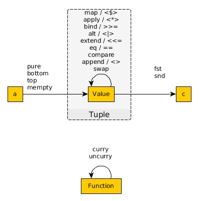

# Tuple

```haskell
data Tuple a b = Tuple a b
```

| Package | Type name | "Plain English" name |
| - | - | - |
| [purescript-tuples](https://pursuit.purescript.org/packages/purescript-tuples/) | `Tuple a b` | 2-value Box

| Usage | Values & their Usage |
| - | - |
| Stores two unordered unnamed values of the same/different types.<br>Can be used to return or pass in multiple unnamed values from or into a function. | `Tuple a b` |

API visualized



Records are nested tuples that can be "open".

```haskell
forall r. { a :: A, b :: B, {- ... -} | r } -- open record
          { a :: A, b :: B, {- ... -}     } -- closed record
```

| Package | Type name | "Plain English" name |
| - | - | - |
| [prim](https://pursuit.purescript.org/builtins/docs/Prim#t:Record) | `{ field :: ValueType }` | an N-value Box

| Usage | Values & their Usage |
| - | - |
| Stores N unordered named values of the same/different types.<br>Can be used to return or pass in multiple unnamed values from or into a function. | `{ field :: ValueType }` |
