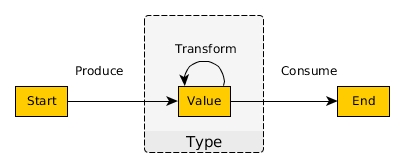

# Basic FP Data Types

Whenever you come across a new type, you should think about it from three perspectives:
- **Produce**: how do I make a value of this type?
- **Transform**: how do I transfom a value of this type into another value of the same type?
- **Consume**: how do I destroy a value of this type?

In other words, think of types according to this picture:

