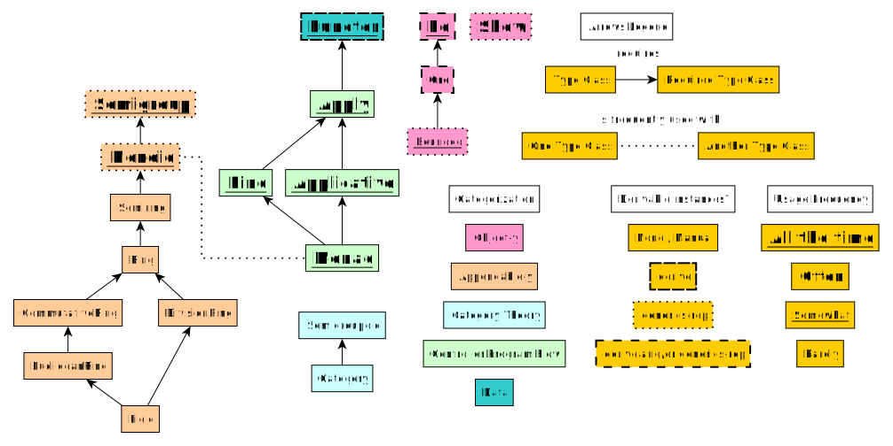

# Prelude's Type Classes

## Relationships

Below is a dependency graph / type class categorization of the type classes found in Prelude. The usage frequency key is my current understanding and may be inaccurate for the "somewhat"/"rare" type classes:


## Tricks for Implementing a Type Class Instance

Keep in mind that when implementing a type class, one does not always need to implement its function with a specific implementation for a given type. There are two situations in which this can occur:

First, this situation can arise when a type class defines two or more functions. Sometimes, a function in a type class can be defined using another function from that same type class. Take, for example, the `Eq` type class:
```haskell
class Eq a where
  eq :: a -> a -> Boolean

  notEq :: a -> a -> Boolean
```
Granted, an `Eq` instance can be derived by the compiler. However, assuming this wasn't the case, there are two ways we could implement it:
1. We could implement only `eq` and implement `notEq` by inverting `eq`'s result.
2. We could implement only `notEq` and implement `eq` by inverting `notEq`'s result

Second, sometimes, a function in a type class can be defined using a function from a required type class. Take, for example, the `Ord` type class:
```haskell
data Ordering
  = LT
  | EQ
  | GT

class (Eq a) <= Ord a where
  compare :: a -> a -> Ordering
```
If we implement `compare`, we can also implement `eq`:
```haskell
data ColoredBox
  = RedBox
  | GreenBox

instance Ord ColoredBox where
  compare RedBox GreenBox = LT
  compare GreenBox RedBox = GT
  compare _ _ = EQ {- which expands to...
  compare RedBox RedBox = EQ
  compare GreenBox GreenBox = EQ
  -}

instance Eq ColoredBox where
  eq a b = (compare a b) == EQ

  notEq a b = (compare a b) /= EQ
```
