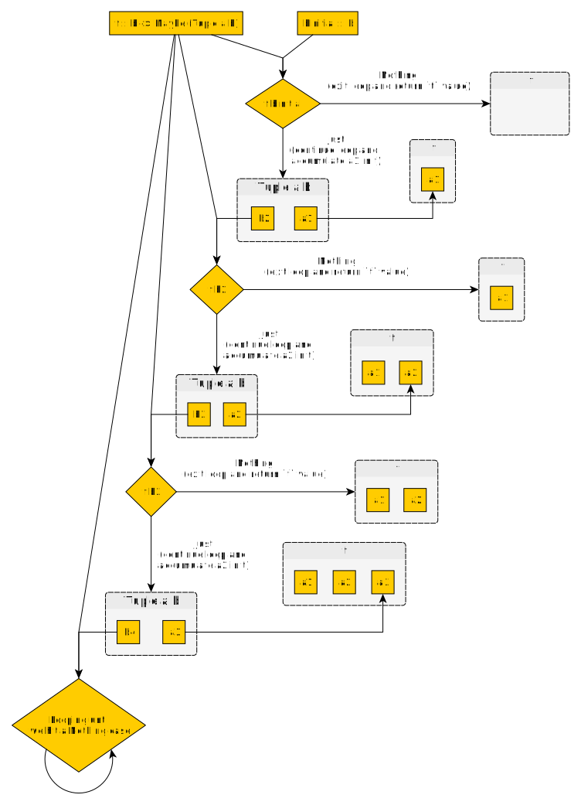

# Unfoldable

## Usage

Plain English names:
- Generator
- FP version of a generic "while" loop

```
  Given
    a function, `f`,
      that uses the next `b` value to generate
        either the case that ends the while loop, `Nothing`
        or the case that continues the while loop, `Just`
          which wraps a `Tuple` so that it can return
            the first or next value, `a`, that gets "put into" the `t` container
              and
            the next `b` value that is then used by `f`
              to run the next iteration in the loop
  and
    the first `b` value
return a container/collection, `t`, that stores all the `a` values
  that were generated by the `f` function,
    which may "contain" 0 or many `a` values.
```

It enables:
- a way to generate a `List` of `Ints`s where each `Int` in the `List` is one greater than the previous `Int`
- a way to run the same `Effect`/`Aff` computation multiple times until a given condition is true

## Definition

### Code Definition

Don't look at its docs until after looking at the visual overview in the next section: [Unfoldable](https://pursuit.purescript.org/packages/purescript-unfoldable/docs/Data.Unfoldable#t:Unfoldable)

```haskell
-- We'll ignore the `Unfoldable1` superclass for now..
class Unfoldable1 t <= Unfoldable t where
  unfoldr :: forall a b. (b -> Maybe (Tuple a b)) -> b -> t a
```

### Visual Overview




### Examples

We'll implement an instance for `List a`.

#### `List`'s Instance

```haskell
data List a = Nil | Cons a

instance Unfoldable List where
  unfoldr :: forall a b. (b -> Maybe (Tuple a b)) -> b -> List a
  unfoldr f initialB = case f initialB of
    Nothing -> Nil
    Just (Tuple a nextB) -> Cons a (unfoldr f nextB)
```

## Laws

None

## Derived Functions

### Overview of Possible Functions for `f`

The only part of `unfoldr f initialB` we can hard-code in a derived function is the `f` function. There are three different functions we could use for `f`:
```haskell
-- We'll use this type alias in the next couple of sections
type UnfoldrFunction a b = b -> Maybe Tuple a b

-- case 1
alwaysReturnJust :: forall a b. a -> b -> UnfoldrFunction a b
alwaysReturnJust a b = \initialB -> Just (Tuple a b)

-- case 2
alwaysReturnNothing :: forall a b. UnfoldrFunction a b
alwaysReturnNothing _ = Nothing

-- case 3
itDepends :: forall a b. UnfoldrFunction a b
itDepends = -- possibilities are shown later
```

| Case Name | Derived Function Name | Result |
| - | - | - |
| case 1 | !!! 😱😱😱 !!! | **Runtime Error: Infinite loop!** |
| case 2 | [`none`](https://pursuit.purescript.org/packages/purescript-unfoldable/docs/Data.Unfoldable#v:none) | Produces an empty `t` |
| case 3 | `replicate`, `replicateA`, and `fromMaybe` | see below overviews of each function

Case 1 functions always produce a runtime error due to creating an infinite loop. They will appear in two ways:
```haskell
-- obvious because Just is always returned
example1 = unfoldr (const Just (Tuple 0 0)) 0

-- Not as obvious in situations where
-- there are a lot of possible conditions
example2 =
  unfoldr f 0
  where
  f nextB
    | nextB < 0  = Just (Tuple 1 2)
    | nextB > 0  = Just (Tuple 2 -4)
    | nextB == 0 = Just (Tuple 8 4)
    | otherwise  = Nothing
      -- ^ this case never occurs
```

### Case 3 Functions

#### Using a countdown or countup function to do something `n`-many times

```haskell
countUp :: forall a. Int -> UnfoldrFunction a Int
countUp limit = \nextInt ->
  if nextInt >= limit then Nothing
  else Just (Tuple aValue (nextInt + 1))

countDown :: forall a. UnfoldrFunction a Int
countDown = \nextInt ->
  if nextInt <= 0 then Nothing
  else Just (Tuple aValue (nextInt - 1))
```

These kinds of functions are used in the following derived functions:
- [`replicate`](https://pursuit.purescript.org/packages/purescript-unfoldable/docs/Data.Unfoldable#v:replicate) - Add the same `a` value to a `t` container `x` number of times.
- [`replicateA`](https://pursuit.purescript.org/packages/purescript-unfoldable/docs/Data.Unfoldable#v:replicate) - Run the same applicative-based computation `x` number of times and store their results in the `t` container.

#### Converting a `Maybe` into another type that has an `Unfoldable` instance

- [`fromMaybe`](https://pursuit.purescript.org/packages/purescript-unfoldable/docs/Data.Unfoldable#v:fromMaybe)
