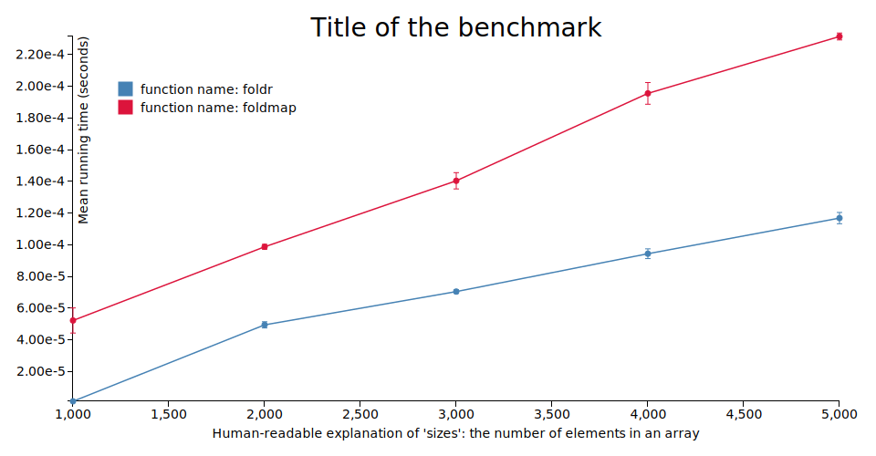

# Benchmarking

Purescript has a few benchmarking libraries:

| Name | Status | Comments |
| - | - | - |
| [purescript-benchotron](https://pursuit.purescript.org/packages/purescript-benchotron/7.0.0) | Up-to-date | Uses QuickCheck<br>Output results only in Node<br>Results are viewable only via graphs |
| [purescript-minibench](https://pursuit.purescript.org/packages/purescript-minibench/2.0.0/docs/Performance.Minibench) | Up-to-date | Provides quick estimates but not very accurate benchmarks
| [purescript-benchmark](https://pursuit.purescript.org/packages/purescript-benchmark/0.1.0) | Outdated (PS `0.11.7`) | Doesn't require QuickCheck<br>Outputs results in Node and Browser<br>Output is full ASCII table with percentage values

In this folder, we'll be covering `benchotron` because it works for `0.12.0` and has finer accuracy than `minibench` and includes graphs.

This benchotron graph...



... was the result of [this somewhat unreadable output](./benchmark-results/file-name-for-output.json)

## Compilation Instructions

`Benchotron` is a Purescript library that provides bindings to [`Benchmark.js`](https://benchmarkjs.com/). As such, you will need to install that library via the command below:
```bash
# Note: If you install this locally and then run the benchmark
# it will succeed. If you install it globally, Node won't
# be able to find `benchmark`.
npm install benchmark
```

Since `benchotron` is not in the default package set (yet), you'll need to create your own local custom package set. Fortunately, I've done most of the tedious work for you. Follow these instructions:
```bash
# 1. Make the necessary directory
mkdir -p .psc-package/custom-set--psc-0.12.0-20180828
# 2. Copy the packages.json file into the folder
cp packages.json .psc-package/custom-set--psc-0.12.0-20180828/packages.json
```
3. Create a file called `psc-package.json` in the folder, `Hello World/Benchmarking`.
4. Copy the following JSON into `psc-package.json` file:
```json
{
  "name": "includes-benchotron",
  "set": "custom-set--psc-0.12.0-20180828",
  "source": "file:///home/user/path-to-containing-folder/purescript-reference/21-Hello-World/06-Benchmarking/packages.json",
  "depends": [
    "console",
    "quickcheck",
    "psci-support",
    "effect",
    "prelude",
    "benchotron"
  ]
}
```
5. Update the `/home/user/path-to-containing-folder/` part of the file path in the `source` field to the purescript-reference folder on your local computer
6. Save the `psc-package.json` file
7. Install the packages (no need to verify them): `psc-package install`

You can now use `benchotron` via psc-package.

## Generating benchmark results

1. Run the below command
```bash
pulp --psc-package run --src-path "benchmark" -m Benchmarking.Syntax.Benchotron
```
2. It will output a file in the freshly-created `tmp` directory
3. Upload the outputted file to [this link](http://harry.garrood.me/purescript-benchotron-svg-renderer/)
4. Download the graph as an SVG or PNG

## Generating benchmarks for real-world projects

In real-world projects, one would run this command:
```bash
pulp --psc-package run -m Performance.ModulePath.To.MainModule --src-
path benchmark --include "src:test"
```
