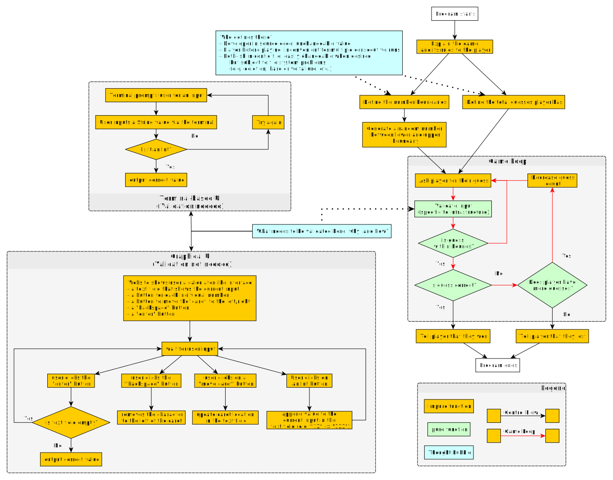
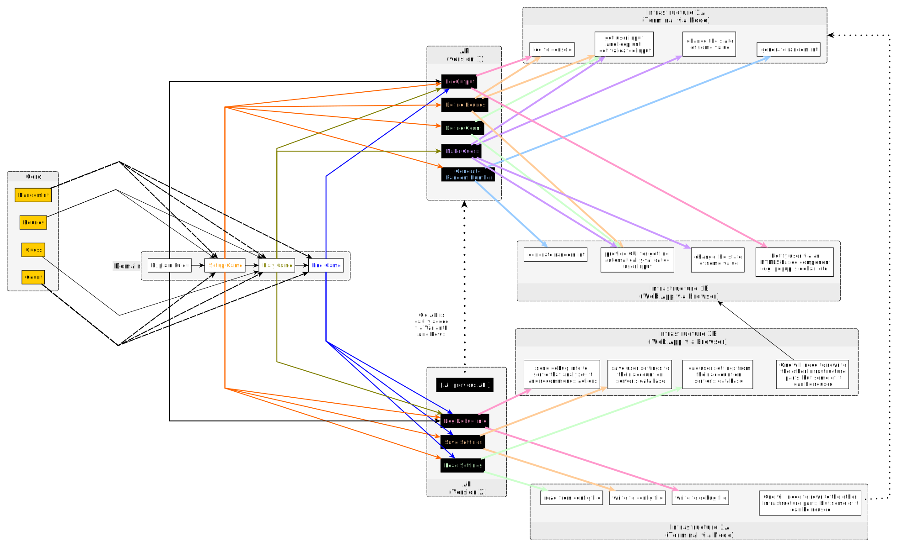

# Random Number

This folder will show how to build a random number game using the Onion Architecture idea.

The following image is the general flow of the program:

The following image is a rewritten version of the above flow using the onion architecture. The arrows from Core to Domain indicate how the domain uses the core to build a program. The arrows from Domain to Infrastructure indicate how one level is "interpreted"/"tranlsated" into another level via a natural transformation:

The actual code demonstrated here only implements the Node infrastructure for the first version of the API. However, one could quickly build a browser version using Halogen or a similar library.
