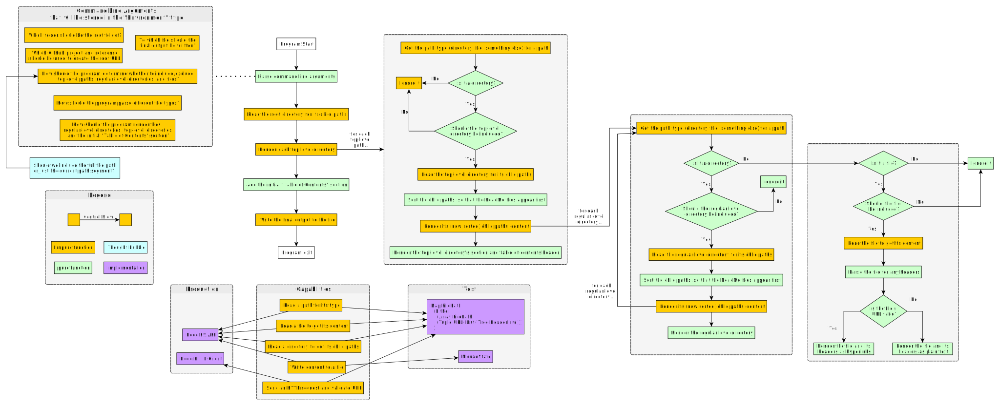

# Design Thought Process

## Specification

Purpose
- Build a program that generates a Table of Contents file of all the folder's (recursive) files

Principles
- Generated links can be configured to work with other source-code-hosting sites (e.g. BitBucket) or other URL formats for section headers / line numbers
- The Table of Contents output can be rendered using different formats (e.g. Markdown, HTML, etc.)
    - Markdown
        - Nested levels could be rendered via nested bullet points
    - HTML
        - Nested levels could be rendered via nested bullet points or using nested `

 ... 
` HTML tags

Outcome 1
- When running the program, the user can easily configure which foldlers/files to include/exclude
    - For folders, we can use a blacklist filter: if a folder name matches an excluded folder (e.g. `output/`, `.spago`, etc.), we'll skip it and all of its contents.
    - For files, we can use a whitelist filter: if a file's extension matches a specific one, we should include it. For our purposes, we're only concerned about Markdown, PureScript, and JavaScript files (ie.g. `*.md`, `*.purs`, and `*.js`).
- The program outputs or overwrites the ToC file with content (see below for example). When a URL is clicked, it will open the corresponding page for this repo on GitHub...
    - Why GitHub and not something else? Because this repo is hosted on GitHub
    - Thus, the links that are generated will need to work with GitHub's link specifications:
        - For markdown files, this will use the regular markdown format (i.e. `file-name.md#section-header`).
        - For PS files (e.g. Syntax folder), it will highlight the corresponding section's header by referring to its line in that file (i.e. `file-name.purs#L4`).
- ...using a tag.
    - The ToC should only be updated when a new release is made. Thus, the `development` branch's ToC file will always be outdated. Likewise, the `latestRelease` branch will be correct only for one release. When a new major release is made, previous releases would no longer refer to the correct pages if files' names or locations had changed, leading to broken links.
    - Thus, the links should refer to a tag on GitHub rather than a branch name or a commit hash, so that each release always refers to itself as the version to use for finding files.

The format of the ToC should look like this:

## Table of Contents

- [link to each top-level folder's section in this file]()

## Top-Level Folder

- [ReadMe]() - if it exists
- [01-file]()
- [02-file]()
- 03-folder - no hyperlink
    - [ReadMe]() - if it exists
    - [01-file]()
    - 02-folder - no hyperlink
        - [ReadMe]() - if it exists
        - [01-file]()
- 04-folder - no hyperlink
    - [ReadMe]() - if it exists
    - 01-folder - no hyperlink
        - [ReadMe]() - if it exists
        - [01-file]()

An example using current project setup

## Table of Contents

- [Getting Started]()
- [Syntax]()
- [Hello World]()

## Getting Started

- [ReadMe]()
- [01-Install-Guide.md]()
- [02-The-REPL.md]()
- [03-Other-Important-Info.md]()

## Build Tools

- [ReadMe]()
- 01-Tool-Comparisons
    - [01-Dependency-Managers.md]()
    - [02-Build-Tools.md]()
- 02-CLI-Options
    - [ReadMe.md]()
- [03-New-Projects-From-Start-To-Finish.md]()

## Application Structure

### Level 4 / Core

We'll first define the types we'll be using throughout our program. When I thought about this particular 'domain', I came up with these concepts:

| Type Name | Meaning | Implementation
| - | - | - | - |
| `HeaderInfo` | All the info needed to render one Markdown header: the header's level, the header's text as a human-readable format (e.g. "This is a header"), and the header's text as an anchor-link to be appended to the file's name (e.g. "#this-is-a-header"). | `{ level :: Int, text :: String, anchor :: String }`
| `Tree HeaderInfo` | Stores a single level-2 header and all of its nested headers | --
| `List (Tree HeaderInfo)` | Stores a file's possibly-empty list of level-2 header trees | --
| -- | -- | --
| `WebUrl` | A String that represents a website URL | `type WebUrl = String`
| `FilePath` | A String that represents a file path | `type FilePath = String`
| `UriPath` | An efficient top-down way to store both the current path's file system path and its corresponding URL path | `type UriPath = { fs :: FilePath, url :: WebUrl }`
| -- | -- | --
| `GitHubRepo` | The data we need to be able to produce the root URL to the corresponding GitHub repo at a specific reference (branch, tag, commit) | `{ username :: String, project :: String, ref :: String }`

### Level 3 / Domain

Our program consists of six stages
1. Recursively walk the file system, starting at the root directory.
    - In the first level, only include the top-level directories.
    - In the levels that follow, only include the directories and files we specify.
2. When we reach a file that should be included, render it by...
    1. verifying that it's corresponding URL returns a 200 HTTP code
    2. attempting to parse the file for any headers
    3. Render the file and its headers using the validated URL
    4. Return to the parent directory
3. When a directories' paths have all been rendered, render it by...
    1. Rendering all of its chid paths' content
    2. Rendering the directory and appending the child paths' rendered content
    3. Return to the parent directory
4. When a top-level directory's paths has been rendered, render it by...
    1. Rendering all of its chid paths' content
    2. Rendering the top-level directory and appending the child paths' rendered content
    3. Return to the root directory
5. When all top-level directories have been rendered, add the "table of contents" section that comes before their content
6. Write the final content to the output file.

The following image is the general flow of the program:

In addition to the above, we'll also have a parser and a renderer. Both will be provided via the `Env` type, so that we can easily use a different parser approach or a different output type.

If I implement a parser that parses markdown headers in a nested manner, it will get very complicated and will likely not make as much sense to newer people. It will also take more time and thought to do. So, to keep things simple, we'll parse content using a two-step approach:
1. parse a file for all of its headers using a line-by-line approach
2. iterate through the list of headers and nest them correctly using a fold.

For this project's goals, we'll only provide a Markdown renderer. However, we could also provide an HTML renderer.

### Level 2 / API

The "effects" or "capabilities" we need to run this program are relatively simple:
- The capability to read a path on the file system and determine whether it is a file or a directory
- The capability to read a directory via its path and return back all of its children as file paths
- The capability to read a file's contents
- The capability to write content to a file
- The capability to log messages to the user to help them see what is going on

### Level 1 / Infrastructure

The above capabilities require access to a file system on a computer. Implementing a CLI program via Node and Yargs makes this simple. We could implement a Halogen-based interface, but that would require making a server-client architecture. That's too complex for now, but we may implement it at a future time later:
- The capability to read a path on the file system and determine whether it is a file or a directory
    - `Node.FS.Aff`
- The capability to read a directory via its path and return back all of its children as file paths
    - `Node.FS.Aff`
- The capability to read a file's contents
    - `Node.FS.Aff`
- The capability to write content to a file
    - `Node.FS.Aff`
- The capability to log messages to the user to help them see what is going on
    - `Console.Log` - just print things to the screen
    - `Node.FS.Aff` - log things to a file via `appendFile`

Since PureScript could be compiled to a non-JavaScript backend, I'll also attempt to structure the code, so that it is backend-independent. If we want to switch to something other than Node, we will only need to re-implement the `AppM` and `Infrastructure` levels

### Level 0 / Machine Code

- Production: we'll use `Aff` to run the Node-based program
- Test: (still a work in progress)
