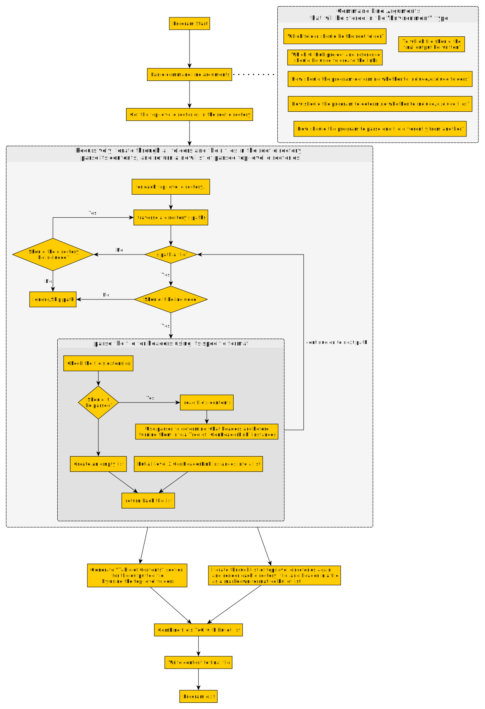

# Design Thought Process

## Specification

Purpose
- Build a program that generates a Table of Contents file of all the folder's (recursive) files

Principles
- Can be expanded to work with other source-code-hosting sites (e.g. BitBucket) or other URL formats for section headers / line numbers

Outcome 1
- When running the program, the user can easily configure which foldlers/files to include/exclude
    - For folders, we can use a blacklist filter: if a folder name matches an excluded folder (e.g. `output/`, `.psc-package`, etc.), we'll skip it and all of its contents.
    - For files, we can use a whitelist filter: if a file's extension matches a specific one, we should include it. For our purposes, we're only concerned about Markdown, PureScript, and JavaScript files (ie.g. `*.md`, `*.purs`, and `*.js`).
- The program outputs or overwrites the ToC file with content (see below for example). When a URL is clicked, it will open the corresponding page for this repo on GitHub...
    - Why GitHub and not something else? Because this repo is hosted on GitHub
    - Thus, the links that are generated will need to work with GitHub's link specifications:
        - For markdown files, this will use the regular markdown format (i.e. `file-name.md#section-header`).
        - For PS files (e.g. Syntax folder), it will highlight the corresponding section's header by referring to its line in that file (i.e. `file-name.purs#L4`).
- ...using a tag.
    - The ToC should only be updated when a new release is made. Thus, the `development` branch's ToC file will always be outdated. Likewise, the `latestRelease` branch will be correct only for one release. When a new major release is made, previous releases would no longer refer to the correct pages if files' names or locations had changed, leading to broken links.
    - Thus, the links should refer to a tag on GitHub rather than a branch name or a commit hash, so that each release always refers to itself as the version to use for finding files.

The format of the ToC could appear in two different ways:
- As a expandable outline using nested `

 ... 
` HTML tags
    - This is easier to scroll through, but comes at the cost of collapsing the summary tags every time the page reloads/refreshes
    - I haven't yet tested whether this works on GitHub when rendered as a Markdown file.
- As a single outline using nested bullet points
    - This will make the page longer, so it might help to have a ToC for each top-level folder's section.

The format of the ToC should look like this:

## Table of Contents

- [link to each top-level folder's section in this file]()

## Top-Level Folder

- [ReadMe]() - if it exists
- [01-file]()
- [02-file]()
- 03-folder - no hyperlink
    - [ReadMe]() - if it exists
    - [01-file]()
    - 02-folder - no hyperlink
        - [ReadMe]() - if it exists
        - [01-file]()
- 04-folder - no hyperlink
    - [ReadMe]() - if it exists
    - 01-folder - no hyperlink
        - [ReadMe]() - if it exists
        - [01-file]()

An example using current project setup

## Table of Contents

- [Getting Started]()
- [Syntax]()
- [Hello World]()

## Getting Started

- [ReadMe]()
- [01-Install-Guide.md]()
- [02-The-REPL.md]()
- [03-Other-Important-Info.md]()

## Build Tools

- [ReadMe]()
- 01-Tool-Comparisons
    - [01-Dependency-Managers.md]()
    - [02-Build-Tools.md]()
- 02-CLI-Options
    - [ReadMe.md]()
- [03-New-Projects-From-Start-To-Finish.md]()

## Application Structure

### Level 4 / Core

We'll first define the types we'll be using throughout our program. When I thought about this particular 'domain', I came up with these concepts:

| Type Name | Meaning | Implementation
| - | - | - | - |
| `MarkdownHeaderInfo` | All the info needed to create and nest a Markdown link: the header's level, the header's text as a human-readable format (e.g. "This is a header"), and the header's text as an anchor-link to be appended to the file's name (e.g. "#this-is-a-header"). Instances of this type may contain additional MarkdownHeaderInfo instances of a greater depth/level (i.e. a Level 2 header that contains one or more Level 3 headers, which may contain one or more Level 4 headers, ... etc.) | `{ level :: Int, text :: String, anchor :: String }`
| `CodeHeaderInfo` | All the info needed to create and nest a Markdown link stored in a source code file: the header's level, the header's text as a human-readable format, and the line number of the file on which the header appears. Similar to MarkdownHeaderInfo, it can nest other CodeHeaderInfo instances that have a greater header level. | `{ level :: Int, text :: String, lineNumber :: Int }`
| `GenHeaderLink` | To make it easy to render both `MarkdownHeaderInfo` and `CodeHeaderInfo` types (and all other header types that might be added in the future easily), a function that produces a properly indented markdown-formatted bullet list whose content is a markdown-formatted hyperlink of a header (see above 'final output' example). This function will produce the correct markdown when given the number by which to indent the hyperlink and the full GitHub URL of the file that contains the header. | `(\indent fullURL -> "   - [header text](fullURL#headerLink)")`
| -- | -- | --
| `FileWithHeaders` | The path name of a file that should be included (e.g. `my-file.md`) and a list (if any) of all level 2 headers that can be rendered via `GenHeaderLink`. These Level 2 headers are stored as a `Tree`, so that headeres can be nested. Thus, headers with a smaller header level appear closer to the left margin than those with greater header level. | `{ name :: String, headers :: List (Tree GenHeaderLink) }`
| `DirectoryPath` | Represents a directory file path | `newtype DirectoryPath = DirectoryPath String`
| `ParsedContent` | Indicates that the content of a directory/file has been parsed and can be rendered as plain text (directory) or as a hyperlink (file) | `type ParsedContent = Either Directory FileWithHeaders`
| `Directory` | A `DirectoryPath` and its list of `ParsedContent` | `data Directory = Directory DirectoryPath (List ParsedContent)`
| `TopLevelDirectory` | Same as `Directory` but different in that it cannot be nested in another `Directory` instance like `Directory`. | `data TopLevelDirectory = TopLevelDirectory DirectoryPath (List ParsedContent)`
| -- | -- | --
| `GitHubRepo` | The data we need to add to the GitHub website URL to link to the correct repo and tag | `{ username :: String, project :: String, ref :: String }`
| `RootToParentDir` | The full relative file path from the root directory on a local computer to the parent directory of another path, whether that be a file or a directory. | `newtype RootToParentDir = RootToParentDir String`

### Level 3 / Domain

Our program consists of four stages
1. get the top-level directories
2. parse their contents recursively and convert the results into our types above
3. render the top-level directories into a markdown-formatted text
4. write that text to the target file

The following image is the general flow of the program:

### Level 2 / API

The "effects" or "capabilities" we need to run this program are relatively simple:
- The capability to read a path on the file system and determine whether it is a file or a directory
- The capability to read a directory via its path and return back all of its children as file paths
- The capability to write content to a file
- The capability to log messages to the user to help them see what is going on

### Level 1 / Infrastructure

The above capabilities require access to a file system on a computer. Implementing a CLI program via Node and Yargs makes this simple. We could implement a Halogen-based interface, but that would require making a server-client architecture. That's too complex for now, but we may implement it at a future time later:
- The capability to read a path on the file system and determine whether it is a file or a directory
    - `Node.FS.Aff`
- The capability to read a directory via its path and return back all of its children as file paths
    - `Node.FS.Aff`
- The capability to write content to a file
    - `Node.FS.Aff`
- The capability to log messages to the user to help them see what is going on
    - `Console.Log` - just print things to the screen
    - `Node.FS.Aff` - log things to a file via `appendFile`

### Level 0 / Machine Code

Production: we'll use `Aff` to run the Node-based program 
Test: (still a work in progress)
