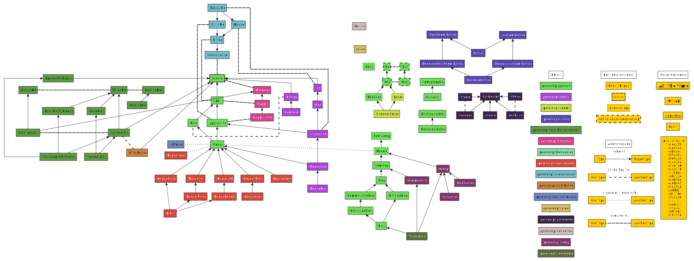

# Type Classes

## Why Are PureScript's Type Classes So Granular?

See Phil's explanation of [Counterexamples of Type Classes](https://blog.functorial.com/posts/2015-12-06-Counterexamples.html)

## Automatically Deriving Instances

This was the conversation I had with monoidmusician on the Slack channel about `purescript-generics-rep` and what need it satisfies for deriving type class instances. I've edited it for clarity:
> Me: I have quick question about deriving type class instances via the `purescript-generics-rep` library. Type classes can be derived in a few ways if the underlying types already have an instance. For example, if I have `data T = T Int`, I can use `derive instance Eq/Show/etc. T`. If I have `newtype T = T Int`, I can use `derive newtype instance [rest of the stuff]`. What does `purescript-generics-rep` add that is not already covered by those two?

> monoidmusician: `generics-rep` lets you work with the representations of sum and product types (all ADTs basically, not just those with one constructor with one field) in a type-safe way
> one of the coolest uses I’ve found is deriving optics, but you need some background in lenses and prisms to understand what’s happening and the benefits of it: https://pursuit.purescript.org/packages/purescript-generics-rep-optics/0.1.0

> Me: So `data T = T Int` works, but as soon as I add another parameter (e.g. `data T = T Int Int Int`), then `derive instance ...` stops working and I need to use the generics-rep library?

> monoidmusician: not so much ... the builtin typeclasses will let you derive most ADTs, that’s not the issue, but you can’t newtype derive if it’s not a newtype (one constuctor with one field), so `generics-rep` covers other typeclasses (like `BoundedEnum` I think? I forget)
> this is my bullet-point overview of deriving methods:
>    - newtypes only apply to ADTs with one constructor with one field (hint: it’s best if you use a newtype whenever you can)
>    - newtype deriving only applies to newtypes (of course), and it directly inherits the same behavior
>    - the regular deriving covers a large variety of ADTs (even recursive ones), but only a few classes (`Eq`, `Ord`, `Functor`, ...)
>    - generics-rep covers a similarly large number of ADTs, and it adds to the number of derivable classes (`Bounded`, `Enum`, `Monoid`, ...), but it cannot handle higher-kinds, so `Functor` is out
>    - for classes such as `Eq` and `Functor` in particular, the instances are reasonably unique, so behavior will usually be the same across the deriving methods, but performance will change, usually with: newtype > derive > generics-rep ... this also remedies the caveat I mentioned above about “[a newtype derived instance] directly inherits the same behavior”
>
> also note that each generic class aimed at deriving will put different constraints on what kind of ADTs it will handle: for instance, `GenericMonoid` only handles empty ADTs and product shapes whose fields are all monoids

See [Justin Woo's short tutorial on it](https://purescript-simple-json.readthedocs.io/en/latest/generics-rep.html) and its [documentation](https://pursuit.purescript.org/packages/purescript-generics-rep/6.1.0) and the corresponding [optics](https://pursuit.purescript.org/packages/purescript-generics-rep-optics/1.1.0) library

## Relationships

This SVG file (WIP, but still helpful) shows the relationships between the type classes (inheritance hierarchy, dual relationships, usage frequency, and package location) throughout the ecosystem:

## Functions

There is also an Excel file ([Type-Class-Functions.xlsx](./assets/Type-Class-Functions.xlsx)) that documents the functions of said type classes using a chart like so (**Note: the following chart is long-vertically and short-horizontally to reduce horizontal scrolling. In the real chart, this is inverted**):

| | Example1 | Example2
| - | - | - |
| package (the 'purescript-' prefix is omitted, so 'prelude' is really 'purescript-prelude') | prelude | prelude
| Type class name | Functor | Functor
| Function Definition (Either defined in the initial type class (I) or dervied using that function (D)) | I | D
| Alias symbol (If no symbol exists, then there is no alias) | <$> | $>
| Alias infix direction & precedence (`direction` is either left (L) or right (R) `precedence` is 1..9) | L 4 | L 4
| Type Parameter (what the type that follows the type class (e.g. `Functor f`)) | f | f
| Function Name | map | voidLeft
| Constraints (These usually appear in derived functions, but may also appear in initial functions) | | Functor f
| Return type | f b | f b
| Arg 1 | (a -> b) | f a
| Arg 2 | f a | a
| ...   | ... | ... |
| Arg N | ... | ... |

## Laws

TODO

## Category Theory

- See Bortosz Mileski's
    - (unofficial) [PDF / Hard back of all his blog posts](https://github.com/hmemcpy/milewski-ctfp-pdf)
    - [blogs](https://bartoszmilewski.com/2014/10/28/category-theory-for-programmers-the-preface/)
    - [videos](https://www.youtube.com/playlist?list=PLbgaMIhjbmEnaH_LTkxLI7FMa2HsnawM_)
- Tom Leinster's [Basic Category Theory](https://arxiv.org/abs/1612.09375) (intended audience: people with "relatively little mathematics background)
